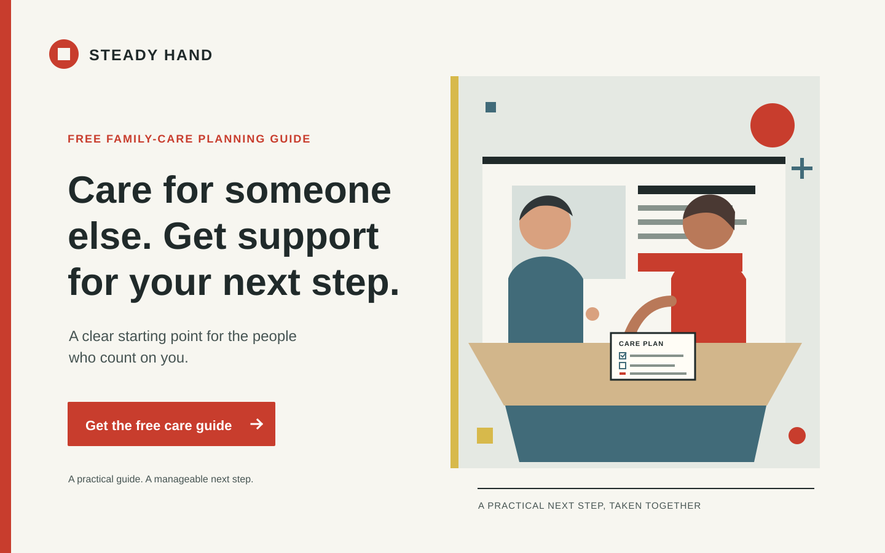

# Caregiver
[Back to this section](README.md) · [Home](../README.md)

## What is it?
The Caregiver is a brand archetype organized around protecting, supporting, and helping others. In Margaret Mark and Carol S. Pearson's brand-archetype framework, its central promise is compassionate service: make people feel supported and safer. It is a strategic storytelling model, not a clinical personality type or evidence that a company is caring.

## How do you recognize or use it?
Look for a patient, reassuring voice; clear explanations; welcoming, respectful imagery; and practical help that reduces someone's burden. It can suit health and family services, education, charities, and products built around care or safety. Make the support concrete, preserve the audience's agency, and avoid pity, guilt, overpromising, or presenting self-sacrifice as the caregiver's duty.

Both concepts below use the same fictional service, Steady Hand, and its free family-care planning guide. The guide is a hypothetical offer created for this exercise, not an existing service.

### Examples



Archetype: Caregiver
Style: [Bauhaus (modernist)](https://www.moma.org/explore/inside_out/2009/11/06/bauhaus-the-graphic-design-department-goes-back-to-school/)
Persuasion: Reciprocity, by offering a useful guide for free before asking for any further action.
Headline: Care for someone else. Get support for your next step.
CTA: **Get the free care guide** — opens the guide download.

The practical, orderly layout makes the next step easy to find, while the shared-table scene presents care as respectful teamwork. A free planning guide makes the Caregiver promise tangible and applies reciprocity without inventing testimonials or pressuring the visitor.

### Example 2


**Image:** Original Memphis-inspired PNG illustration created for this exercise. Vivid color blocks, an arch, dots, and zigzags frame the family-care scene while leaving the headline and button on a quiet, high-contrast field.

Archetype: Caregiver
Style: [Memphis (postmodernist)](https://www.vam.ac.uk/articles/what-is-postmodernism)
Persuasion: Reciprocity, by offering the same practical guide for free.
Headline: Care for someone else. Get support for your next step.
CTA: **Get the free care guide** — opens the guide download.

The vivid, irregular Memphis-inspired shapes make the service feel approachable rather than clinical, while the caring scene and plain-language offer keep its purpose clear. The same free guide provides the reciprocal value as in Example 1, so the comparison changes the visual style without changing the promise or CTA.

## Sources
- Mark, Margaret, and Carol S. Pearson. *The Hero and the Outlaw: Building Extraordinary Brands Through the Power of Archetypes*. McGraw-Hill, 2001. Framework for the Caregiver archetype.
- [Robert Cialdini, Influence at Work: The Science of Persuasion](https://www.influenceatwork.com/7-principles-of-persuasion/). Reciprocity principle; the free-guide application above is hypothetical.
- [MoMA: Bauhaus graphic design](https://www.moma.org/explore/inside_out/2009/11/06/bauhaus-the-graphic-design-department-goes-back-to-school/). Museum discussion of Bauhaus typography, grid, and economy of form.
- [V&A: What is Postmodernism?](https://www.vam.ac.uk/articles/what-is-postmodernism). Museum overview of postmodern design, including Memphis.
- [The Met: Ettore Sottsass, "Carlton" Room Divider, 1981](https://www.metmuseum.org/art/collection/search/486989). Collection record describing a Memphis design; cited as visual reference only, not reproduced.

Image credits: [Caregiver modernist hero](../assets/heroes/caregiver/modernist.svg) and [Caregiver postmodernist hero](../assets/heroes/caregiver/postmodernist.png) are original artwork created for this exercise. No external imagery is used.
```